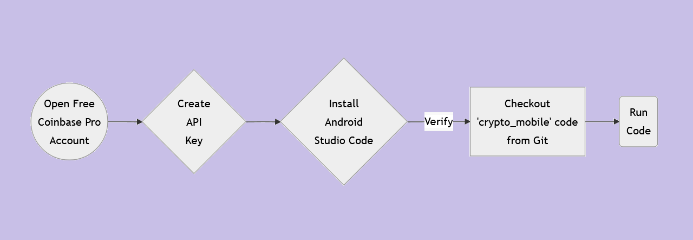
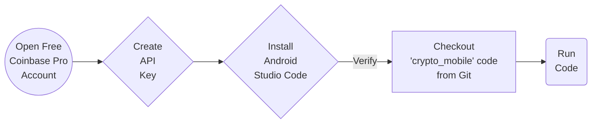

# How to Call Coinbase Pro REST API from Android Mobile Application
Sample Android Mobile Application that shows how to call Coinbase Pro REST API.

### Workflow

### References
<ul>
 <li><a href="https://www.coinbase.com/join/islam_w88t">Coin Base Account (Free)</a></li>
 <li><a href="https://pro.coinbase.com/">Coin Base Pro Exchange Account (Free)</a></li>
 <li><a href="https://developer.android.com/studio">Android Studio</a></li>
</ul>

### Tutorial

